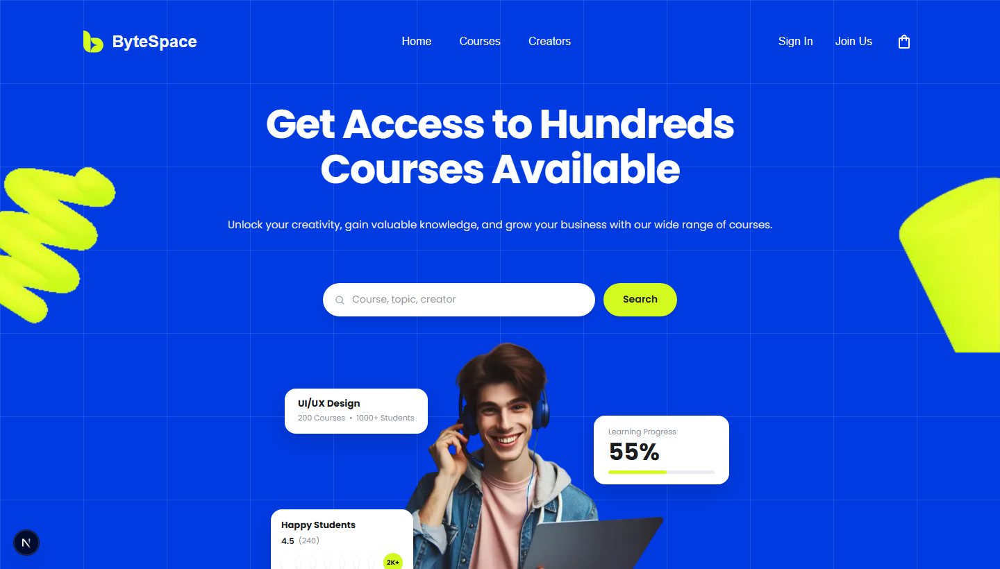

<p align="center">
  <svg xmlns="http://www.w3.org/2000/svg" viewBox="0 0 32 32" width="64" height="64" fill="none">
    <g transform="translate(1.5, 0)">
      <path d="M10.5 10.5C10.5 4.70101 5.79899 0 0 0V21C0 26.799 4.70101 31.5 10.5 31.5V10.5Z" fill="#D4FB20"/>
      <path d="M18.375 10.5C24.174 10.5 28.875 15.201 28.875 21H21C15.201 21 10.5 16.299 10.5 10.5L18.375 10.5Z" fill="#D4FB20"/>
      <path d="M18.375 31.5C24.174 31.5 28.875 26.799 28.875 21H21C15.201 21 10.5 25.701 10.5 31.5L18.375 31.5Z" fill="#D4FB20"/>
    </g>
  </svg>
</p>

<h1 align="center">ByteSpace</h1>

<p align="center">
  <strong>Get Access to Hundreds of Courses Available.</strong><br/>
  An online learning platform where curious minds discover skills, follow expert creators, and track their growth — all in one place.
</p>

<p align="center">
  <a href="https://bytespace-weld.vercel.app/"></a>
  <a href="https://nextjs.org/"></a>
  <a href="https://react.dev/"></a>
  <a href="https://www.typescriptlang.org/"></a>
  <a href="https://tailwindcss.com/"></a>
  <a href="https://playwright.dev/"></a>
</p>

<p align="center">
  <a href="https://bytespace-weld.vercel.app/">
    
  </a>
</p>

---

## 📋 Table of Contents

- [About the Project](#about-the-project)
- [Key Features](#key-features)
- [Tech Stack](#tech-stack)
- [Screenshots / Demo](#screenshots--demo)
- [Project Structure](#project-structure)
- [Getting Started](#getting-started)
  - [Prerequisites](#prerequisites)
  - [Installation](#installation)
  - [Running the Project](#running-the-project)
- [Usage](#usage)
- [Testing](#testing)
- [Contributing](#contributing)
- [Author / Contact](#author--contact)
- [Acknowledgements](#acknowledgements)

---

## 📖 About the Project

**ByteSpace** is a production-grade online learning and skill courses platform built with **Next.js 16 App Router**, **React 19**, **Tailwind CSS v4**, and **TypeScript**.

It was designed to match a Figma specification with pixel-perfect visual fidelity across four viewport widths — desktop (`1440px`), tablet (`1024px`, `768px`), and mobile (`390px`) — and ships with a full Playwright automated test suite covering functionality, responsive layout, and visual regression.

The platform allows students to browse and enroll in courses, track lesson progress, read and filter reviews, and follow their favourite creators — all with state persisted to `localStorage` so it survives page refreshes without a backend.

---

## ✨ Key Features

- 🔍 **Course Discovery & Search** — Search bar with real-time filtering by 9 category pills, difficulty level dropdown, and sort order. Empty-state handling included.
- 📚 **Course Detail Pages** — Each course has three sub-pages: an overview with sneak-peek media and a key-points checklist, a module/lesson explorer with a progress tracker, and a reviews section with interactive star filter.
- 👤 **Creator Profiles** — Dedicated profile pages per creator showing bio, metrics, and course listings. Follow/unfollow toggle with `localStorage` persistence across sessions.
- 🔐 **Authentication Pages** — Sign In and Sign Up flows with client-side email/password validation, demo status feedback, and social auth buttons.
- 📱 **Fully Responsive** — Adapts seamlessly from `390px` mobile to `1440px` desktop with a slide-in mobile navigation menu.
- ♿ **Accessible** — Semantic HTML5 landmarks, keyboard-accessible modals with focus management and Escape key handling, and descriptive ARIA labels throughout.
- 💾 **Persistent State** — Enrollment, follow state, and newsletter subscription use concurrent-safe `useSyncExternalStore` with `localStorage`.
- 🧪 **Automated Tests** — 45 Playwright tests across three suites: 9 functional acceptance tests, 27 responsive layout tests, and 9 visual baseline captures.

---

## 🛠 Tech Stack

| Layer | Technology | Version |
|---|---|---|
| Framework | [Next.js](https://nextjs.org/) (App Router) | 16.x |
| UI Library | [React](https://react.dev/) | 19.x |
| Styling | [Tailwind CSS](https://tailwindcss.com/) | v4 |
| Language | [TypeScript](https://www.typescriptlang.org/) | 5.x |
| Class Utilities | [clsx](https://github.com/lukeed/clsx) + [tailwind-merge](https://github.com/dcastil/tailwind-merge) | latest |
| Testing | [Playwright](https://playwright.dev/) | 1.63+ |
| Deployment | [Vercel](https://vercel.com/) | — |

---

## 📁 Project Structure

```
bytespace/
├── public/
│   ├── fonts/                  # Self-hosted fonts (ClashDisplay, Satoshi)
│   └── images/                 # Static images and SVGs
│
├── src/
│   ├── app/
│   │   ├── (auth)/             # Auth route group (no public nav)
│   │   │   ├── login/
│   │   │   └── register/
│   │   ├── (public)/           # Public route group (with header/footer)
│   │   │   ├── page.tsx        # → / (Home)
│   │   │   ├── search/         # → /search
│   │   │   ├── courses/
│   │   │   │   └── [slug]/     # → /courses/:slug
│   │   │   │       ├── page.tsx          # Course overview
│   │   │   │       ├── lessons/page.tsx  # Course lessons
│   │   │   │       └── reviews/page.tsx  # Course reviews
│   │   │   └── creators/
│   │   │       └── [slug]/     # → /creators/:slug
│   │   ├── globals.css         # Global styles + Tailwind v4 layers
│   │   ├── layout.tsx          # Root layout
│   │   ├── not-found.tsx       # Custom 404
│   │   ├── error.tsx           # Error boundary
│   │   └── loading.tsx         # Global loading UI
│   │
│   ├── components/
│   │   ├── auth/               # LoginForm, RegisterForm, AuthPanel, AuthVisual
│   │   ├── course/             # CourseCard, CourseGrid, CourseHero, CourseTabs,
│   │   │                       # CourseSidebar, EnrollmentAction, EnrollmentModal,
│   │   │                       # MediaPreview, ReviewListSection, ShareCourseButton
│   │   ├── creator/            # CreatorHero
│   │   ├── filters/            # CategoryChips, FilterToolbar, Pagination,
│   │   │                       # SearchHero, EmptySearchState
│   │   ├── home/               # HomeHero, HomePartners, HomeDiscovery, HomePaths,
│   │   │                       # HomeGrowthFeature, HomeManageFeature,
│   │   │                       # HomeCreatorCTA, HomeTestimonials
│   │   ├── layout/             # SiteHeader, SiteFooter, MobileNav,
│   │   │                       # Container, BlueGrid, NewsletterForm
│   │   └── ui/                 # Avatar, AvatarStack, Logo
│   │
│   ├── data/                   # Static seed data (courses, creators, categories,
│   │                           # lessons, reviews)
│   ├── lib/                    # cn() utility, constants, format helpers
│   └── types/                  # Shared TypeScript interfaces (Course, Creator)
│
├── tests/
│   ├── functionality.spec.ts   # 9 functional acceptance tests
│   ├── responsive.spec.ts      # 27 responsive layout tests
│   └── visual-regression.spec.ts # 9 visual baseline captures
│
├── .env.example                # Environment variable template
├── next.config.ts
├── tsconfig.json
├── playwright.config.ts
└── package.json
```

---

## 🚀 Getting Started

### Prerequisites

Make sure you have the following installed:

| Tool | Minimum Version |
|---|---|
| [Node.js](https://nodejs.org/) | 18.18+ or 20+ |
| npm | 9+ |
| Git | any recent version |

### Installation

```bash
# 1. Clone the repository
git clone https://github.com/JoyTarafder/ByteSpace.git

# 2. Move into the project directory
cd ByteSpace

# 3. Install dependencies
npm install

# 4. Copy the environment variables template
cp .env.example .env.local
```

> Open `.env.local` and fill in any required values (see `.env.example` for descriptions).

### Running the Project

```bash
# Start the development server
npm run dev
```

Open [http://localhost:3000](http://localhost:3000) in your browser. The page hot-reloads on file changes.

```bash
# Build for production
npm run build

# Start the production server locally
npm start
```

---

## 📘 Usage

Once the dev server is running, explore these routes:

| URL | Page |
|---|---|
| `http://localhost:3000/` | Home — hero search, course categories, learning paths |
| `http://localhost:3000/search` | Catalog — filter by category, level, and sort order |
| `http://localhost:3000/courses/build-digital-asset-comprehensive-guide` | Course detail example |
| `http://localhost:3000/courses/build-digital-asset-comprehensive-guide/lessons` | Lesson explorer with progress |
| `http://localhost:3000/courses/build-digital-asset-comprehensive-guide/reviews` | Star-filtered reviews |
| `http://localhost:3000/creators/sarah-jenkins` | Creator profile — follow/unfollow |
| `http://localhost:3000/login` | Sign In form |
| `http://localhost:3000/register` | Sign Up form |

**Trying the enrollment flow:**
1. Go to any course page (`/courses/[slug]`)
2. Click **"Enroll Now"** to open the enrollment modal
3. Confirm enrollment — the state is saved to `localStorage` and persists on refresh

**Following a creator:**
1. Go to `/creators/sarah-jenkins`
2. Click **"Follow"** — the button toggles and the state persists across page navigations

---

## 🧪 Testing

ByteSpace ships with a 45-test Playwright suite. Make sure the dev server is running before executing tests.

```bash
# Run the full test suite
npm test

# Run only functional acceptance tests (9 tests)
npx playwright test tests/functionality.spec.ts

# Run responsive layout tests at 1024px, 768px, and 390px (27 tests)
npx playwright test tests/responsive.spec.ts

# Capture visual baselines at 1440px desktop (9 tests)
npx playwright test tests/visual-regression.spec.ts
```

**Code quality checks:**

```bash
# Run ESLint — must report 0 errors, 0 warnings
npm run lint

# Type-check the entire codebase — must report 0 errors
npx tsc --noEmit
```

---

## 👤 Author / Contact

**Joy Tarafder**

- GitHub: [@JoyTarafder](https://github.com/JoyTarafder)
- Project Repo: [github.com/JoyTarafder/ByteSpace](https://github.com/JoyTarafder/ByteSpace)
- Live Demo: [bytespace-weld.vercel.app](https://bytespace-weld.vercel.app/)
- Email: [joytarafder3@gmail.com](mailto:joytarafder3@gmail.com)

---

## 🙏 Acknowledgements

- [Next.js](https://nextjs.org/) — for the App Router, file-based routing, and server components
- [Tailwind CSS](https://tailwindcss.com/) — for the utility-first styling system
- [Playwright](https://playwright.dev/) — for the powerful end-to-end testing framework
- [Vercel](https://vercel.com/) — for seamless deployment and hosting
- [Clash Display & Satoshi](https://www.fontshare.com/) — typefaces from Fontshare used in the design

---

<p align="center">Made with ❤️ by <a href="https://github.com/JoyTarafder">Joy Tarafder</a></p>

---
